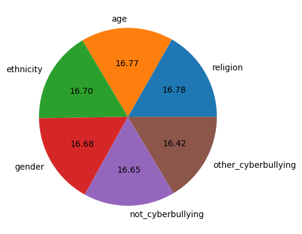
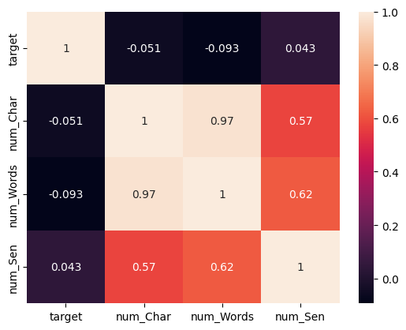
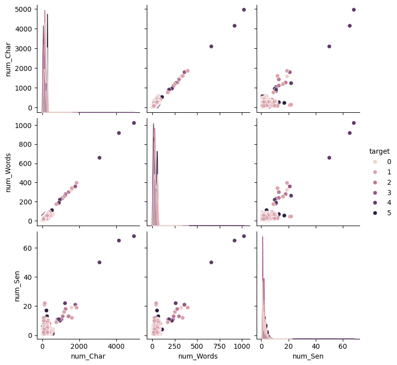
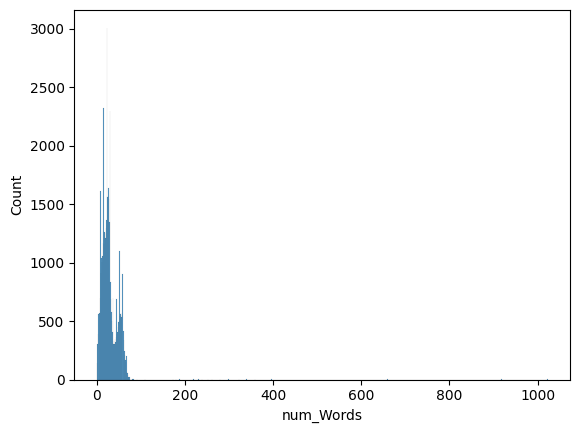
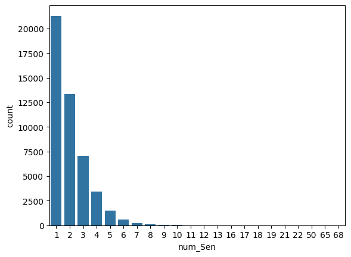

# Cyber Bullying Detector

# 🚨 Cyberbullying Detection (Multiclass NLP Project)

This repository contains a **complete pipeline for detecting cyberbullying** in text messages using **machine learning**. 
The system covers everything from **data preprocessing and exploratory data analysis (EDA)** to **model training, deployment via FastAPI**, 
and a **Streamlit web app** for interactive use.

---

# Article:
[Project Article](https://medium.com/@uneebashaikh/my-buildables-peer-project-journey-building-an-ai-cyberbullying-detection-system-1b1fabcb2417)

## 📊 Dataset & Target Classes

The dataset consists of labeled text samples, with each sample categorized into one of the following classes:

- 🧑 **Age Cyberbullying**  
- 🌍 **Ethnicity Cyberbullying**  
- ✝️ **Religion Cyberbullying**  
- 🚻 **Gender Cyberbullying**  
- 🔹 **Other Cyberbullying**  
- ✅ **Not Cyberbullying**  

These labels represent different forms of harmful online communication. The **goal of the project** is to classify a given text into one of these categories.

---

## 🔬 Exploratory Data Analysis (EDA)

EDA was performed to understand the dataset distribution, class balance, and language patterns. Some of the key insights include:

1. **Target Distribution (Pie Plot)**  
   The dataset is **imbalanced**, with some categories (e.g., *Religion Cyberbullying*) having more samples compared to others (e.g., *Age Cyberbullying*).  
   

2. **Heatmap of Feature Correlations**  
   Identified relationships between engineered features such as sentence length, word count, and character distribution.  
   

3. **Pairplot**  
   Demonstrates how numerical features vary across classes.  
   

4. **Histograms & Bar Plots**  
   Showed sentence length distribution, common words across bullying categories, and frequency of words.  
     
     

These analyses revealed why **class imbalance handling** (e.g., `class_weight="balanced"`) was essential for fair predictions.

---

## ⚙️ Data Preprocessing

The following preprocessing steps were applied:

- Lowercasing text  
- Removing punctuation, numbers, and special characters  
- Removing stopwords  
- Tokenization  
- Lemmatization (reducing words to root form)  
- Converting text into **numerical vectors** using **TF-IDF (Term Frequency – Inverse Document Frequency)**  

The TF-IDF representation was then saved as `vectorizer.pkl` for reusability.

---

## 🏗️ Model Training

We trained a **Logistic Regression classifier** on the TF-IDF vectors. Key points:

- Used **`class_weight="balanced"`** to handle class imbalance.  
- Performed **GridSearchCV** for hyperparameter tuning.  
- Evaluated using **Accuracy, Precision, Recall, and F1-Score per class**.  
- Saved the final model as `model.pkl`.  

### Sample Evaluation (Confusion Matrix & Classification Report)

Confusion Matrix shows misclassifications across categories, highlighting which bullying types are harder to detect.  
(Insert confusion matrix image if available)

---

## 📂 Project Structure

```
CyberBullying-DetectionSystem/
│── API_bundle/
│   ├── app.py                
│   ├── models.pkl
|   ├── vectorizer.pkl         
│   ├── streamlit_app.py   
|   |── static/
|   |   └── styles.css 
│   ├── templates/
│   │   └── index.html      
│
│── assets/
|   |── barplot.png
|   |── heatmap.png
|   |── histplot.png
|   |── pairplot.png
|   |── pie_chart.png            
│── data/
|   |── cyberbullying_tweets.csv          
│── notebook/
|   |── spam_Detection.ipynb          
│── .gitignore
|── .gitattribute                  
│── README.md                
```


---

## Project Demo

### Example#1
Demo\image1.png

### Example#2
Demo\image2.png

---


---

## Project Demo

### Example#1
 

 ### Example#2


## 🚀 Deployment Options

### 🔹 Streamlit App (Interactive Web UI)
The Streamlit app provides an **easy-to-use interface** to test predictions.

Run:
```bash
streamlit run streamlit_app.py
```
Access at: [http://localhost:8501](http://localhost:8501)

### 🔹 FastAPI Service (REST API)
The FastAPI service exposes a `/predict` endpoint.

Run:
```bash
uvicorn API_HANDLING.api:app --reload
```
Docs available at: [http://127.0.0.1:8000/docs](http://127.0.0.1:8000/docs)

Example request:
```bash
curl -X POST "http://127.0.0.1:8000/predict" -H "Content-Type: application/json" -d "{"text":"You are so dumb!"}"
```

Response:
```json
{
  "text": "You are so dumb!",
  "cyberbullying_detected": true,
  "predicted_class": "age_cyberbullying",
  "confidence": 0.87
}
```

---


## 🎯 Example Predictions

Input Texts → Model Predictions:

- "You're such a loser, nobody likes you." → **Age Cyberbullying (0.88)**  
- "Go back to your country, we don’t need you here." → **Ethnicity Cyberbullying (0.91)**  
- "Haha, you are pathetic and useless." → **Other Cyberbullying (0.79)**  
- "Good luck with your exams tomorrow!" → **Not Cyberbullying (0.95)**  

---

## 📌 Future Work for Later

- 🔹 Fine-tune **DistilBERT** / **BERT** for improved accuracy (>90%)  
- 🔹 Add **explainability** with LIME/SHAP to understand predictions  
- 🔹 Deploy on **Heroku, AWS, or Render** for public access  
- 🔹 Collect more balanced datasets for fairer classification  

---

## 👨‍💻 Author
  
  - Syed Darain Hyder Kazmi
  - GitHub: [My GitHub](https://github.com/DarainHyder)
  - LinkedIn: [My Linkedin](https://linkedin.com/in/syed-darain-hyder-kazmi)
  - Uneeba Shaikh
  - Github:[My GitHub](https://github.com/UNEEBASHAIKH)
  - Linkedin:[My Linkedin](https://www.linkedin.com/in/uneeba-shaikh-257625265/)
  - Ahsan Atiq
  - Github: [My GitHub](https://github.com/ahsanatiq05)
  - Linkedin: [My Linkedin](https://www.linkedin.com/in/muhammad-ahsan-atiq-399653378/)


---
